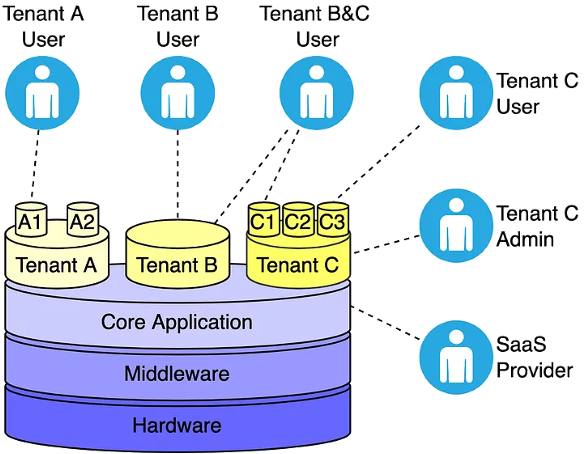

---
copyright:
  years: 2026
lastupdated: "2026-09-23"

subcollection: pattern-intra-org-multitenancy
keywords: application native multitenancy, tenant isolation, SaaS, shared infrastructure, IBM Cloud, multitenancy

content-type: howto

---

{{site.data.keyword.attribute-definition-list}}

# Application native multitenancy
{: #app-native}

With application native multitenancy, the application itself isolates tenants from one another, for example, by using tenant IDs that control access to data.
{: shortdesc}

{: caption="Application native multitenancy" caption-side="bottom"}

## Advantages
{: #advantages}

Application native multitenancy provides the following advantages for your organization:

Instant provisioning and self-service management
:   Application administrators can instantly provision and manage tenants through a self-service interface, streamlining the onboarding process and reducing operational delays.

Optimized costs
:   All tenants share the application and underlying infrastructure, including compute, storage, and databases, resulting in improved cost efficiency.

Simplified deployments and upgrades
:   No need to manage separate application instances for each tenant. Using one application instance simplifies deployment processes and makes upgrades more efficient and less error-prone.

Dynamic resource allocation
:   Shared resources allow for dynamic allocation based on real-time demand, which helps prevent idle capacity and improves overall resource utilization.

Centralized backup and restore
:   A unified backup and restore strategy helps ensure data protection and recovery across all tenants, reducing complexity and improving reliability.

## Challenges
{: #challenges}

Application native multitenancy includes the following challenges for your organization:

- A strong audit strategy needs to be in place.
- Tenant-specific customizations might be limited.
- Noisy neighbor issues might impact performance for other tenants.
- Shared data residency.
- Tenants that require different versions than one another.
- Adding a feature for application native multitenancy might be complex and increase time to delivery.
- Chargebacks are more difficult to calculate than with other approaches.

## Determine suitability
{: #suitability}

As you evaluate application native multitenancy, consider the following questions:

- How important are costs?
- Can your organization tolerate some level of resource sharing between tenants without strict isolation?
- Can you expect tenants to have similar resource usage patterns to balance workloads effectively?
- Is the deployment expected to have a high number of small-to-medium tenants?
- Is logical data isolation at the application and database level acceptable?
- Is strict physical data separation a critical requirement?

### Readiness checklist
{: #checklist}

Use the following checklist to determine whether your organization is ready to pursue application native multitenancy.

| Task | Description |
| - | - |
| - [ ] **Architecture and design**  | * Supports logical separation of tenants (schema-based, table-based, or hybrid). \n* Provides data isolation per tenant (logical or physical). \n * Can scale horizontally to accommodate multiple tenants dynamically. \n * Uses configurable tenant provisioning for onboarding new tenants easily. |
| - [ ] **Security and access control** | * Supports role-based access control or attribute-based access control per tenant. \n* Provides tenant-specific access logs for tracking compliance. \n * Prevents cross-tenant data leakage through proper security boundaries. |
| - [ ] **Data management** | * Supports tenant-specific data backup and restore procedures. \n* Allows tenant-level data retention policies. \n * Enables audit logging per tenant for compliance needs. |
| - [ ] **Configuration and customization** | * Provides tenant-specific configuration options such as themes, settings, and custom logic. \n* Supports custom business rules per tenant without affecting others. \n * Enables feature flags for tenant-specific feature rollouts. |
| - [ ] **Performance and scalability** | * The application maintains performance SLAs even with high tenant load. \n* Allows dynamic resource allocation per tenant. \n * Supports auto-scaling to handle demand spikes from different tenants. |
| - [ ] **Deployment and infrastructure**| * Supports CI/CD pipelines that are multitenant-aware. \n* Can deploy updates without downtime across multiple tenants. \n * Is containerized or cloud-native to support flexible deployments. |
| - [ ] **Monitoring and observability** | * Provides tenant-specific monitoring dashboards. \n* Supports multitenant logging and tracing. \n * Detects and alerts on tenant-specific performance issues. |
| - [ ] **Billing and metering** | Supports tenant-level usage tracking for billing purposes. |
| - [ ] **Compliance and legal** | * Meets GDPR, CCPA, HIPAA, or other regulatory requirements for multitenant environments. \n* Provides tenant-level compliance reports if required. \n * Requires a sharing agreement from different business units, especially when different types of data classification are required. |
{: caption="Readiness checklist for application native multitenancy" caption-side="bottom"}
